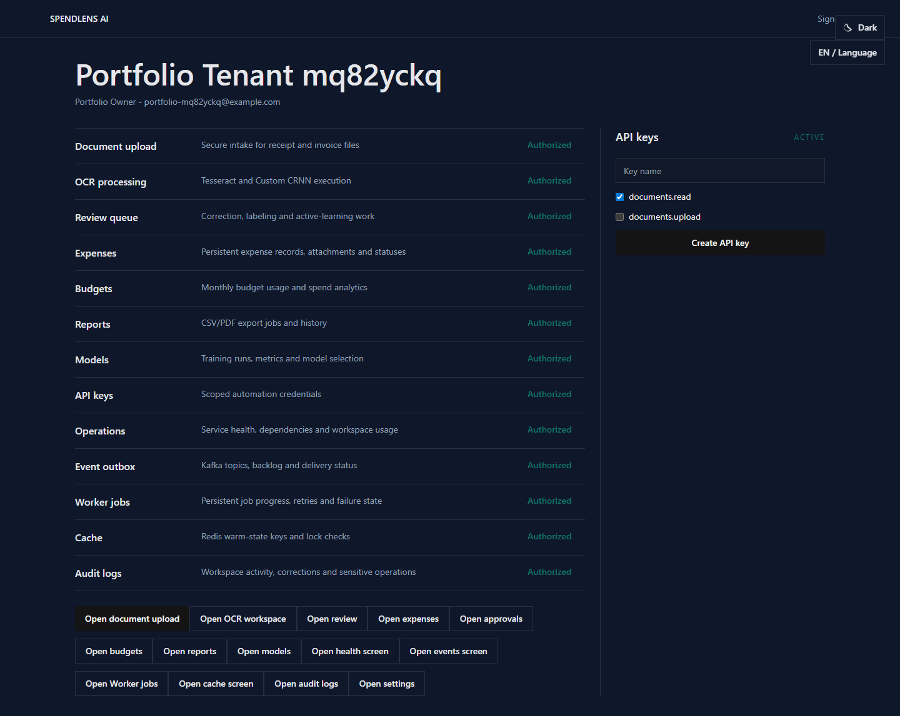
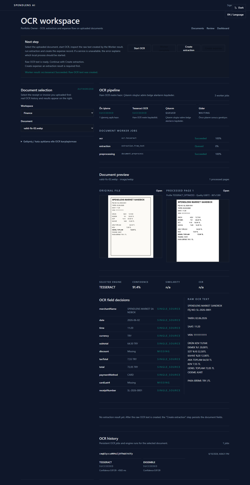
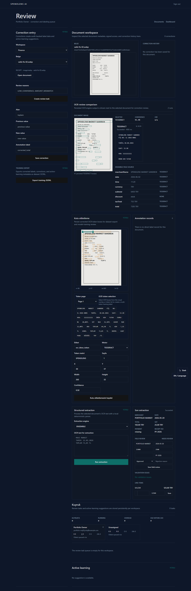

<div align="center">

# SpendLens AI

**Local-first OCR & expense intelligence platform**

Receipt and invoice intake · Tesseract + project-owned Custom OCR · human review · expense workflows · budgets · reports · operations consoles

</div>

---

## Türkçe Özet

SpendLens AI, fiş/fatura/dekont görsellerini yerel ortamda okuyan, çıkan metni akıllıca yapılandıran ve gider yönetiminin tamamını (inceleme, onay, bütçe, rapor) tek bir üründe birleştiren **tamamen yerel** bir harcama istihbarat platformudur.

- **Tamamen yerel:** Tüm servisler (PostgreSQL, Redis, Redpanda/Kafka, MinIO, OCR) kendi makinenizde Docker ile çalışır. Buluta, ücretli OCR/API'ye veri gönderilmez.
- **İki OCR motoru:** Tesseract (üretim tabanı) ve projeye özel eğitilebilir **CRNN/CTC Custom OCR** motoru.
- **İnsan onaylı akış:** OCR → inceleme/düzeltme → gider oluşturma → onay/geri ödeme → bütçe → rapor.
- **Çok kiracılı ve güvenli:** RBAC, denetim kayıtları (audit log), API anahtarları.
- **İki dil:** Türkçe (birincil) ve İngilizce arayüz; açık ve koyu tema.

Hızlı başlangıç için aşağıdaki [Quick Start](#quick-start) bölümüne, tüm dokümantasyona [Documentation](#documentation) bölümünden ulaşabilirsiniz.

---

## What Is SpendLens AI?

SpendLens AI is a local-first platform for **receipt and invoice intelligence**. It turns scanned documents into structured, reviewable data and runs the surrounding business workflow — all on your own machine with free and open-source software only.

The product flow:

```text
Upload document → Preprocess → OCR (Tesseract or Custom OCR) → Extract fields
→ Human review & corrections → Expense creation → Approval / reimbursement
→ Budgets & analytics → Reports & exports
```

Both OCR engines are first-class: **Tesseract** is the production baseline, and **Custom OCR** is a project-owned, trainable CRNN/CTC pipeline that never delegates to other OCR engines. Uncertain results always land in a review queue — the UI shows what happened, whether the result is reliable and what to do next.

## Screenshots

| Dashboard | OCR comparison | Review |
| --- | --- | --- |
|  |  |  |

Regenerate screenshots from the real app with `pnpm portfolio:screenshots` (writes to `docs/screenshots/`).

## Key Features

**Documents & OCR**
- Multi-format upload (JPEG, PNG, WebP, TIFF, BMP, GIF, PDF) with binary signature validation and SHA-256 duplicate detection
- Resumable chunked upload with CRC32 verification and SHA-256 integrity checks
- Preprocessing profiles (denoising, deskew, quality scoring) and page artifacts
- Tesseract OCR with explicit failure handling
- Project-owned Custom OCR: trainable CRNN/CTC model with Turkish finance vocabulary, greedy/beam decoding and honest quality gates (experimental; activation requires passing real-fixture benchmarks)
- OCR comparison view: engine provenance, confidence, conflicts, token bounding boxes

**Review & extraction**
- Deterministic Turkish receipt/invoice field extraction with field and line-item reconciliation
- Review queue with assignment, approval/rejection, corrections, bounding-box annotations and active-learning suggestions
- Dataset export (JSONL) for future training

**Finance workflows**
- Expenses from manual entry, extraction or CSV import; attachments, comments, splits, recurring rules, subscription detection
- Approval workflows with 48-hour SLA tracking and policy warnings/blocks
- Reimbursement claims with approve/reject/mark-paid transitions
- Budgets, monthly spend analytics and finance insights with deterministic local category/anomaly prediction
- CSV, JSONL and PDF report exports stored in object storage

**Platform & operations**
- Multi-tenant workspaces, RBAC, API keys, central audit log
- Durable worker jobs (OCR → extraction → reports chain), outbox/inbox events with Kafka-compatible broker
- Redis caching: rate limits, job hot state, locks, inference/analytics caches
- Admin consoles: health, events, jobs, cache, audit
- Prometheus metrics + Grafana dashboard, structured JSON logs
- Docker Compose and Kubernetes (local-cluster) deployments

## Architecture

```text
┌────────────────────────┐      ┌─────────────────────────────┐
│   apps/web             │      │   apps/api (Fastify)        │
│   Next.js App Router   │ ───▶ │   auth · documents · OCR    │
│   tr / en · light/dark │      │   extraction · review ·     │
└────────────────────────┘      │   expenses · budgets ·      │
                                │   reports · models · admin  │
                                └─────────────┬───────────────┘
                                ┌─────────────┴───────────────┐
                                │  services/ocr (Python)      │
                                │  FastAPI · preprocessing ·  │
                                │  Tesseract · Custom CRNN    │
                                └─────────────┬───────────────┘
        ┌────────────┬────────────┬────────────┼────────────┬────────────┐
   PostgreSQL     Redis      Redpanda        MinIO     Prometheus    Grafana
   (source of     (hot       (Kafka-       (objects:   (metrics)    (dashboards)
    truth)        state)     compatible)     documents,
                                             artifacts)
```

- **PostgreSQL** is the source of truth; **Redis** is hot state/cache only; **Redpanda** carries Kafka-compatible events; **MinIO** stores documents, reports and model artifacts.
- Monetary values are stored as integer minor units (`BigInt`) — no floating point for money.
- `packages/shared` holds domain constants, money handling, RBAC, OCR ensemble and extraction utilities used by API and web.

## Repository Layout

| Path | Description |
| --- | --- |
| `apps/api` | Fastify REST API: modules, worker, event consumer/drainer, OpenAPI, metrics |
| `apps/web` | Next.js App Router UI (Turkish primary, English locale, light/dark themes) |
| `packages/db` | Prisma schema, migrations and seed scripts |
| `packages/shared` | Shared TypeScript domain utilities (money, RBAC, OCR, extraction, CSV) |
| `services/ocr` | Python FastAPI OCR service: preprocessing, Tesseract engine, Custom OCR CRNN pipeline, benchmarks |
| `scripts` | Local development, demo data, benchmark and validation commands |
| `e2e` | Playwright browser acceptance tests |
| `k8s` | Kubernetes local-cluster manifests |
| `ops` | Prometheus alert rules and Grafana provisioning |
| `docs` | Architecture, API, security and operations documentation (index in `docs/README.md`) |

## Tech Stack

| Layer | Technology |
| --- | --- |
| Monorepo | pnpm workspaces + Turborepo |
| API | Fastify, TypeScript, OpenAPI |
| Web | Next.js (App Router), React, Tailwind-style design system |
| Database | PostgreSQL + Prisma (in-memory adapters for tests) |
| Cache | Redis (`ioredis`), in-memory fallback |
| Events | Kafka-compatible broker (Redpanda), durable outbox/inbox |
| Storage | MinIO-compatible object storage (in-memory fallback) |
| OCR | Tesseract (production baseline) + project-owned PyTorch CRNN/CTC Custom OCR |
| Category ML | Deterministic local scikit-learn category/anomaly model |
| Observability | Prometheus metrics, Grafana, structured JSON logs |
| Orchestration | Docker Compose, Kubernetes manifests |
| Tests | Vitest, Playwright, Python unittest |

## Quick Start

### Prerequisites

- Node.js 20+, pnpm 10+
- Docker Desktop / Docker Engine (for PostgreSQL, Redis, Redpanda, MinIO and the OCR service)
- Python 3.12 (for OCR service scripts)

### 1. Install and configure

```bash
cp .env.example .env   # Windows: copy .env.example .env
pnpm install
pnpm db:generate
```

### 2. Start dependencies and OCR service

```bash
pnpm dev:ocr
```

This starts PostgreSQL, Redis, Redpanda, MinIO and the OCR service on non-standard local ports (see table below) and waits for health checks.

### 3. Prepare the database

```bash
pnpm db:migrate
pnpm db:seed
```

The seed creates a fully synthetic demo tenant:

| | |
| --- | --- |
| Tenant slug | `demo` |
| Workspace | `Demo Workspace` |
| Email | `demo.owner@spendlens.local` |
| Password | `SpendLensDemo!2026` |

> These credentials are for local development only — never reuse them anywhere shared.

Optionally populate the demo workspace with synthetic receipts/invoices, OCR runs and reports:

```bash
pnpm demo:prepare
```

### 4. Start the app

```bash
pnpm dev
```

- Web app: http://localhost:18620
- API + OpenAPI docs: http://localhost:18621/docs
- OCR service health: http://localhost:18622/health/live

`pnpm dev` also runs the Custom OCR bootstrap safety gate: a model is activated only when an inference smoke test **and** matching real-fixture benchmark evidence pass.

### Default local ports

| Service | Port |
| --- | --- |
| Web app | `18620` |
| API | `18621` |
| OCR service | `18622` |
| PostgreSQL | `15433` |
| Redis | `16380` |
| Kafka (Redpanda) | `19092` |
| MinIO API / console | `19002` / `19003` |
| Prometheus / Grafana | `19090` / `13001` |

Ports are intentionally non-standard to avoid collisions with other local stacks. Override matching `*_PORT` values in `.env` when needed (see `RUNNING.md`).

### Stop / reset

```bash
pnpm dev:down      # stop services and app containers
pnpm reset:local   # stop and delete local containers + volumes (then re-run setup)
```

## Testing

```bash
pnpm verify              # lint + typecheck + unit tests
pnpm build               # production builds
pnpm test:e2e            # Playwright browser acceptance (memory adapters)
pnpm test:e2e:docker     # browser acceptance against PostgreSQL/Redis/Redpanda/MinIO
pnpm test:ocr-acceptance # real OCR browser flow
pnpm test:custom-ocr     # Custom OCR pipeline tests
pnpm security:audit      # secret scan + route authorization audit
pnpm k8s:validate        # Kubernetes manifest validation
pnpm observability:smoke # live Prometheus/Grafana check
```

## Documentation

| Area | Document |
| --- | --- |
| Documentation index | [docs/README.md](docs/README.md) |
| Setup (first time) | [SETUP.md](SETUP.md) |
| Running / restart | [RUNNING.md](RUNNING.md) |
| User guide | [USER_GUIDE.md](USER_GUIDE.md) |
| Architecture | [ARCHITECTURE.md](ARCHITECTURE.md) |
| API reference | [API.md](API.md) |
| Database | [DATABASE.md](DATABASE.md) |
| Security | [SECURITY.md](SECURITY.md) |
| Privacy | [PRIVACY.md](PRIVACY.md) |
| Expense domain | [EXPENSE_DOMAIN.md](EXPENSE_DOMAIN.md) |
| OCR pipeline | [OCR_PIPELINE.md](OCR_PIPELINE.md) |
| Tesseract engine | [TESSERACT_ENGINE.md](TESSERACT_ENGINE.md) |
| Custom OCR model | [CUSTOM_OCR_MODEL.md](CUSTOM_OCR_MODEL.md) |
| Custom OCR dev guide (TR) | [CUSTOM_OCR_DEVELOPMENT_GUIDE.md](CUSTOM_OCR_DEVELOPMENT_GUIDE.md) |
| Model evaluation | [MODEL_EVALUATION.md](MODEL_EVALUATION.md) |
| Datasets & annotations | [DATASET_AND_ANNOTATION.md](DATASET_AND_ANNOTATION.md) |
| Workers & jobs | [WORKERS_AND_JOBS.md](WORKERS_AND_JOBS.md) |
| Kafka events | [KAFKA_EVENTS.md](KAFKA_EVENTS.md) |
| Redis & caching | [REDIS_AND_CACHING.md](REDIS_AND_CACHING.md) |
| Storage (MinIO) | [STORAGE_AND_MINIO.md](STORAGE_AND_MINIO.md) |
| Observability | [OBSERVABILITY.md](OBSERVABILITY.md) |
| Performance | [PERFORMANCE.md](PERFORMANCE.md) |
| Testing | [TESTING.md](TESTING.md) |
| Failure recovery | [FAILURE_RECOVERY.md](FAILURE_RECOVERY.md) |
| Kubernetes | [KUBERNETES.md](KUBERNETES.md) |
| Changelog | [CHANGELOG.md](CHANGELOG.md) |

## Design Decisions

- **Local-first, free stack only** — no paid OCR/AI APIs are required; the platform runs without public internet exposure ([ADR-0001](docs/adr/0001-local-first-open-source-stack.md)).
- **PostgreSQL as source of truth** — Redis, Kafka and MinIO degrade gracefully; the database stays authoritative.
- **Honest OCR reporting** — engine provenance, confidence and conflicts are shown to users; uncertain results go to review instead of being silently accepted.
- **Deterministic ML** — category/anomaly prediction uses a local, reproducible model; Custom OCR activation requires benchmark evidence that matches the exact artifacts (SHA-256 fingerprints).

## Contributing

1. Read `docs/README.md` for the documentation map and `SETUP.md` for the local environment.
2. Run `pnpm verify` before opening changes; add focused tests for new behavior.
3. Keep money handling in integer minor units and preserve the existing auth/RBAC/tenant/audit semantics.

## License

[MIT](LICENSE)
